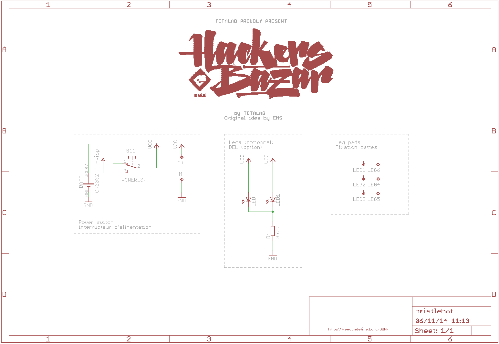

Novela-2014
===========

# Instructions Bristlebot

## Pièces nécessaires

* 1x PCB
* 2x leds
* 1x support de pile
* 1x pile bouton 2032
* 1x interrupteur
* 1x résistance 330 Ohms
* 1x moteur vibreur
* 1x brosse à dent
* 1x scotch double face (env 3cm)
* 2-6x segments de 4-8cm cable réseau

## Pas à pas

1. souder la résistance R1
1. poser un peu d'étain sur la grosse pastille où se trouvera la pile
1. souder le support de pile
1. souder l'interrupteur
1. souder le moteur
1. fixer le moteur au PCB avec le pistolet à colle
1. souder les leds, la patte la plus courte au niveau du symbole (-) sous le PCB
1. mettre du scotch double-face sous le PCB
1. casser une brosse à dent et fixer la partie poilue sous le scotch double-face
1. dénuder les morceaux de cables réseaux
1. souder ces segments de cable réseau au niveau des pattes
